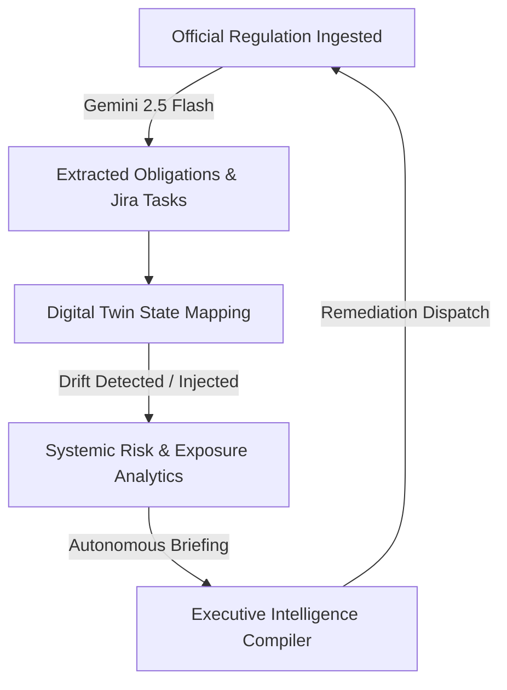

# 🛡️ SentinelX: Autonomous AI Governance & Compliance Fabric for Banking

> **The Governance War Room for Tier-1 Financial Institutions.** SentinelX acts as an autonomous neural compliance nervous system—continuously ingesting regulations, mapping dependencies via a live Digital Twin, predicting risk cascades, and compiling executive briefings powered by **Gemini 2.5 Flash**.

---

## 🚀 The Core Problem & Our Vision

Financial institutions face a tsunami of regulatory changes from authorities like **RBI**, **SEBI**, and the **DPDP Board**. Traditionally, analyzing these directives, translating them into technical tasks, checking system compliance, and alerting board members takes weeks of manual effort, leading to:
1. **Compliance Drift:** Operational systems slowly decay from compliance states due to out-of-band updates.
2. **Delayed Blast-Radius Visuals:** SRE and Risk teams struggle to see how an IAM policy change impacts downstream banking layers.
3. **Siloed Action Items:** Tasks are disconnected from live regulations.

**SentinelX resolves this by creating an autonomous loop:**


---

## 🌟 Key Product Workspaces

### 1. 📂 Regulation Ingestion Workspace
- **Multimodal PDF Processing:** Ingest official PDF directives (e.g., RBI Circulars) directly.
- **AI-Powered Translation:** Gemini 2.5 Flash parses raw legal clauses into structured technical actions.
- **Autonomous Ingestion Daemon:** A polling listener simulating live secure webhook pushes from official RBI feeds.

### 2. 🌐 Digital Twin Topology
- **Interactive SVG System Map:** Visualizes core banking layers: *Mobile Banking App*, *Authentication API*, *IAM System*, *Fraud Detection*, and *Audit Logging*.
- **Blast-Radius Propagation:** Trigger simulated network/auth drifts to visualize ripple effects across parent-child dependencies.
- **Live Telemetry:** Colored status indicators showing realtime health and compliance level.

### 3. 📊 Risk & Simulation Center
- **Systemic Forecasting:** A dynamic risk matrix plotting compliance confidence index, operational exposure, and overall posture index.
- **Drift Exception Engine:** Inject and analyze compliance decay patterns (e.g., expired auth certs, database logging failures) before they impact production.

### 4. 💼 Executive Board Intelligence
- **AI Chief Risk Officer briefings:** Automatically compile board-ready regulatory briefings.
- **Actionable Remediation Roadmap:** Generates concise recommendations, target department JIRA tracking tickets, and estimated timelines.

---

## 🛠️ Tech Stack & Architecture

- **Frontend:** React, Vite, Tailwind CSS, Lucide Icons, Custom Animated Keyframes
- **Backend:** Express.js, TypeScript (`tsx` runtime)
- **AI Core:** `@google/genai` (Google Gen AI SDK) utilizing the high-performance **Gemini 2.5 Flash** model for schema-conforming structural JSON outputs.

---

## ⚙️ Quick Start Guide

### Prerequisites
- **Node.js** (v18+)
- **NPM**

### Step 1: Clone and Install Dependencies
```bash
npm install
```

### Step 2: Configure Environment
Create a `.env` file in the root directory (or update `.env.local`):
```env
PORT=3000
GEMINI_API_KEY="your-gemini-api-key"
```

### Step 3: Run the Development Server
```bash
npm run dev
```
Open **[http://localhost:3000](http://localhost:3000)** in your browser to enter the War Room.

---

## 💡 Hackathon Evaluation Scenarios

For the judges' evaluation, SentinelX features a robust **Offline Fallback & Simulation Framework**:
1. **AI Ingest Demonstration:** Go to *Regulation Workspace* -> *Ingest Circular (AI Sandbox)* -> Upload a PDF or paste text. The system will leverage Gemini 2.5 Flash to automatically categorise, score severity, and outline obligations.
2. **Digital Twin Live Drift:** Go to *Digital Twin Workspace*. Click **Simulate Live Regulation** or click individual nodes to inject drifts and see immediate blast-radius cascading animations.
3. **Board Briefing:** Navigate to *Executive Workspace* to read the Chief AI Risk Officer briefing compiled by Gemini 2.5 Flash based on the current active drifts.
